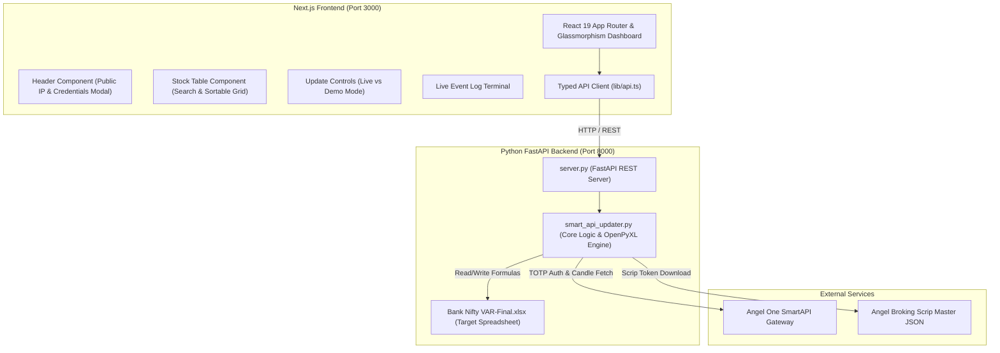

# 📈 SmartAPI Bank Nifty VAR Excel Updater

[](https://nextjs.org/)
[](https://tailwindcss.com/)
[](https://fastapi.tiangolo.com/)
[](https://www.python.org/)
[](LICENSE)

An ultra-modern, professional-grade web application built to automate historical candle data fetching, Last Traded Price (LTP) synchronization, Value at Risk (VAR @ 90%), and Beta sensitivity formula updates for **Nifty Bank** banking stocks directly into Microsoft Excel workbooks (`Bank Nifty VAR-Final.xlsx`) using the **Angel One SmartAPI**.

---

## 🌟 Key Features

- **🚀 Ultra-Modern UI/UX**: Built with Next.js 15 (App Router), Tailwind CSS v4, Framer Motion, and custom glassmorphism primitives for an executive-grade user experience.
- **⚡ Dual Execution Engine**:
  - **Live SmartAPI Mode**: Connects directly to Angel One OpenAPI for daily candle close data & live LTP ticks.
  - **Demo Simulation Mode**: Offline simulation mode that appends synthetic market ticks to test Excel formula integrity without API credentials.
- **🏛️ Full 14 Nifty Bank Stocks Coverage**: Automates HDFC Bank, ICICI Bank, Axis Bank, SBI, Kotak Bank, Bank of Baroda, Union Bank, PNB, Canara Bank, Federal Bank, AU Small Finance Bank, Yes Bank, IndusInd Bank, and IDFC First Bank.
- **📐 Mathematical & Formula Preservation**: Uses `openpyxl` to preserve exact Excel spreadsheet formulas (`=B{row}/B{last_row}-1`, `=VALUE(G{row})`, `=L{row}*$J$4`, Beta, and 90% VAR calculations).
- **🔑 Dynamic TOTP Authentication**: Supports automatic TOTP code generation via a 32-character TOTP secret key or manual 6-digit TOTP input from Google Authenticator / Authy.
- **🌐 Public IP Auto-Detection & Whitelisting Diagnostic**: Automatically discovers your public IP for primary static IP registration in the SmartAPI portal and provides actionable diagnostics on API exceptions.
- **📊 Real-Time Metric Tiles & Interactive Table**: Responsive data grid with instant search filtering, sortable columns, and price movement badges.
- **📜 Live Audit Terminal & Console Log Stream**: High-visibility terminal showing every API request, scrip token download, and row update in real-time.
- **📥 One-Click Excel Download**: Instantly export and download the modified `.xlsx` workbook straight from the browser.

---

## 🏗️ System Architecture



---

## 🛠️ Technology Stack

| Layer | Technologies Used |
| :--- | :--- |
| **Frontend Framework** | Next.js 15+ (App Router, React 19, TypeScript) |
| **Styling & Design System** | Tailwind CSS v4, Custom Glassmorphism, CSS Modules |
| **Icons & Micro-Animations** | Lucide React, Framer Motion, clsx, tailwind-merge |
| **Backend API Framework** | Python 3.10+, FastAPI, Uvicorn (ASGI) |
| **Trading API SDK** | `smartapi-python`, `pyotp`, `requests` |
| **Excel Spreadsheet Engine** | `openpyxl` (data_only and formula preservation modes), `pandas` |
| **Log Management** | `logzero` |

---

## 🚀 Quick Start Guide

### Prerequisites

Ensure you have the following installed on your system:
- **Python**: Version 3.10 or higher
- **Node.js**: Version 20.x or higher
- **npm** or **pnpm** / **yarn**

---

### Installation & Setup

1. **Clone the Repository**:
   ```bash
   git clone https://github.com/your-username/stock-excel-updater.git
   cd stock-excel-updater
   ```

2. **Install Python Dependencies**:
   ```bash
   pip install -r requirements.txt
   ```

3. **Install Frontend Dependencies**:
   ```bash
   cd frontend
   npm install
   cd ..
   ```

---

### Running the Application

You can launch both the **Python FastAPI Backend** (`http://127.0.0.1:8000`) and the **Next.js Frontend** (`http://localhost:3000`) simultaneously with a single command:

```bash
python run_app.py
```

Then open your browser and navigate to **[http://localhost:3000](http://localhost:3000)**.

---

### Manual Launching (Optional)

If you prefer running the backend and frontend in separate terminal windows:

**Terminal 1 (Backend FastAPI Server)**:
```bash
python -m uvicorn server:app --host 127.0.0.1 --port 8000 --reload
```

**Terminal 2 (Next.js Frontend Dev Server)**:
```bash
cd frontend
npm run dev
```

---

## 📖 How It Works Under The Hood

### 1. SmartAPI Authentication Flow
When connecting to Angel One:
1. The user inputs their **SmartAPI Key**, **Client ID**, **Trading PIN/Password**, and **TOTP Secret**.
2. `smart_api_updater.py` computes the live 6-digit TOTP using `pyotp.TOTP(clean_secret).now()`.
3. Calls `SmartConnect.generateSession()` to establish an authenticated session.
4. Returns session tokens used for all subsequent scrip data and candle requests.

### 2. Scrip Token Mapping & Daily Candle Data
- Downloads the latest **OpenAPI Scrip Master** from Angel Broking's CDN to ensure exact instrument token resolution for NSE equity scrips (`HDFCBANK-EQ`, `SBIN-EQ`, etc.) and indices (`Nifty Bank` token `99926009`).
- Requests daily candle historical data (`ONE_DAY` interval) between specified `From Date` and `To Date`.
- If no historical range is available (e.g., weekends/trading holidays), it gracefully falls back to fetching live LTP for today's market day.

### 3. Excel Formula Generation (`openpyxl`)
For each bank sheet in `Bank Nifty VAR-Final.xlsx`:
- Identifies the current last row in column `A`.
- Appends the new date row and writes relative Excel cell formulas:
  - **Price Return (Col C)**: `=B{new_row}/B{last_row}-1`
  - **Nifty Bank Return (Col G)**: `='HDFC Bank'!G{new_row}`
  - **Daily Return Value (Col L)**: `=VALUE(G{new_row})`
  - **Simulator Calculation (Col M)**: `=L{new_row}*$J$4`
- Saves the workbook while preserving all existing conditional formatting, charts, and header metadata.

---

## 🤝 Open Source Contribution Guide

We welcome contributions from developers, quantitative analysts, and financial technology enthusiasts! Here is how you can get started and contribute to this project.

### 💡 Ideas for Future Improvements & Features

If you want to contribute, here are some great areas where you can add value:

1. **⚡ Real-Time WebSocket Streaming**:
   - Implement live tick streaming using `SmartWebSocketV2` to show real-time price updates on the frontend data table.
2. **📈 Multi-Index & Custom Watchlist Support**:
   - Extend support beyond Nifty Bank to **Nifty 50**, **Nifty IT**, **Nifty Financial Services**, and custom user-defined stock watchlists.
3. **💾 Database Persistence & Historical Analytics**:
   - Add SQLite / PostgreSQL database integration to store historical tick data and calculated VAR metrics permanently for analytics and charting.
4. **🐳 Docker Containerization**:
   - Create a `Dockerfile` and `docker-compose.yml` to package FastAPI and Next.js into a single containerized environment.
5. **🤖 Automated Unit & Integration Testing**:
   - Write unit tests using `pytest` for `smart_api_updater.py` and React Testing Library / Jest for Next.js components.
6. **📊 Interactive Charts & Visualizations**:
   - Integrate Recharts or TradingView Lightweight Charts into the Next.js frontend to visualize VAR trends and stock vs index Beta performance.

---

### 📥 How to Contribute (Pull Request Workflow)

1. **Fork the Repository**:
   Click the **Fork** button at the top right of this repository.

2. **Create a Feature Branch**:
   ```bash
   git checkout -b feature/amazing-new-feature
   ```

3. **Make Your Changes**:
   - Follow clean code practices (PEP 8 for Python, ESLint / Prettier for TypeScript).
   - Ensure components use Tailwind CSS design patterns.

4. **Verify Your Changes**:
   - Run Next.js production build:
     ```bash
     cd frontend
     npx next build
     ```
   - Test Python server endpoints:
     ```bash
     python -c "import server; print('Server OK')"
     ```

5. **Commit & Push**:
   ```bash
   git commit -m "feat: add real-time WebSocket ticker streaming"
   git push origin feature/amazing-new-feature
   ```

6. **Open a Pull Request**:
   Navigate to the original repository and click **New Pull Request**. Describe your changes in detail!

---

## 🛡️ License

Distributed under the **MIT License**. See [`LICENSE`](LICENSE) for more information.

---

## 💬 Support & Feedback

If you encounter any bugs, have questions, or want to suggest new features:
- Open an issue on GitHub: [Issues](../../issues)
- Read the SmartAPI Portal Documentation: [smartapi.angelone.in](https://smartapi.angelone.in)

---

<p align="center">
  Crafted with ❤️ for Quant Traders, Financial Analysts & Developers.
</p>
